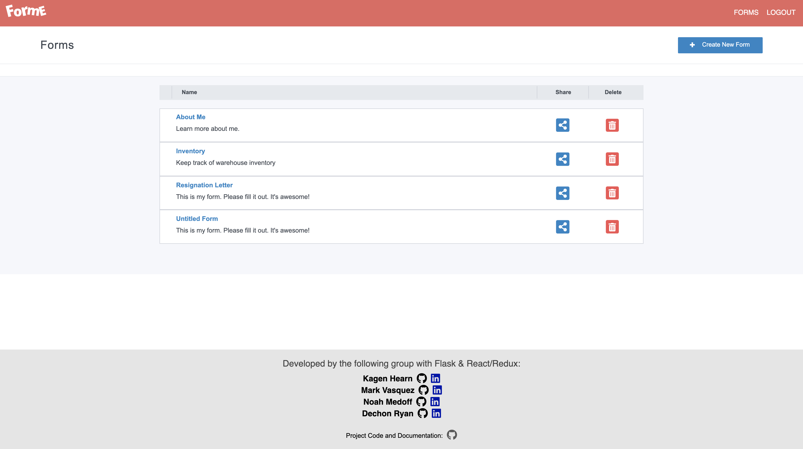
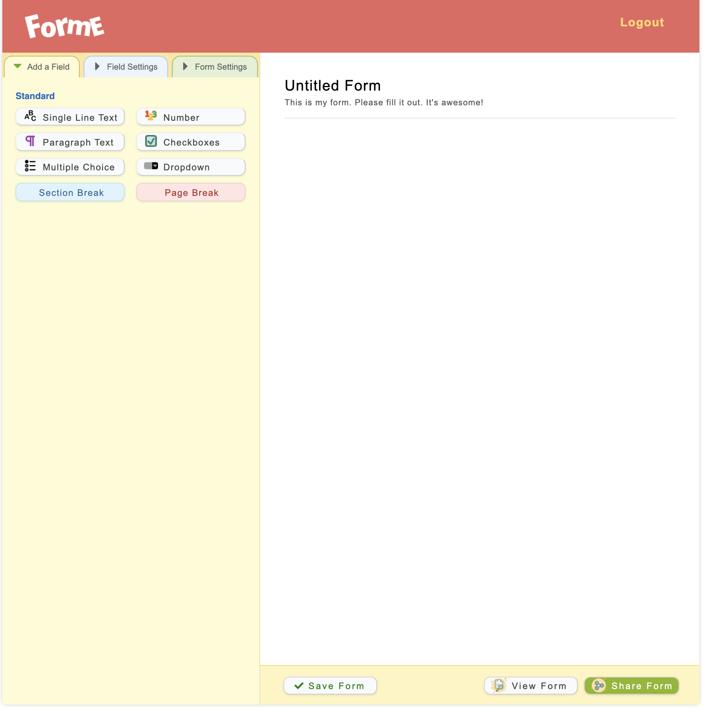
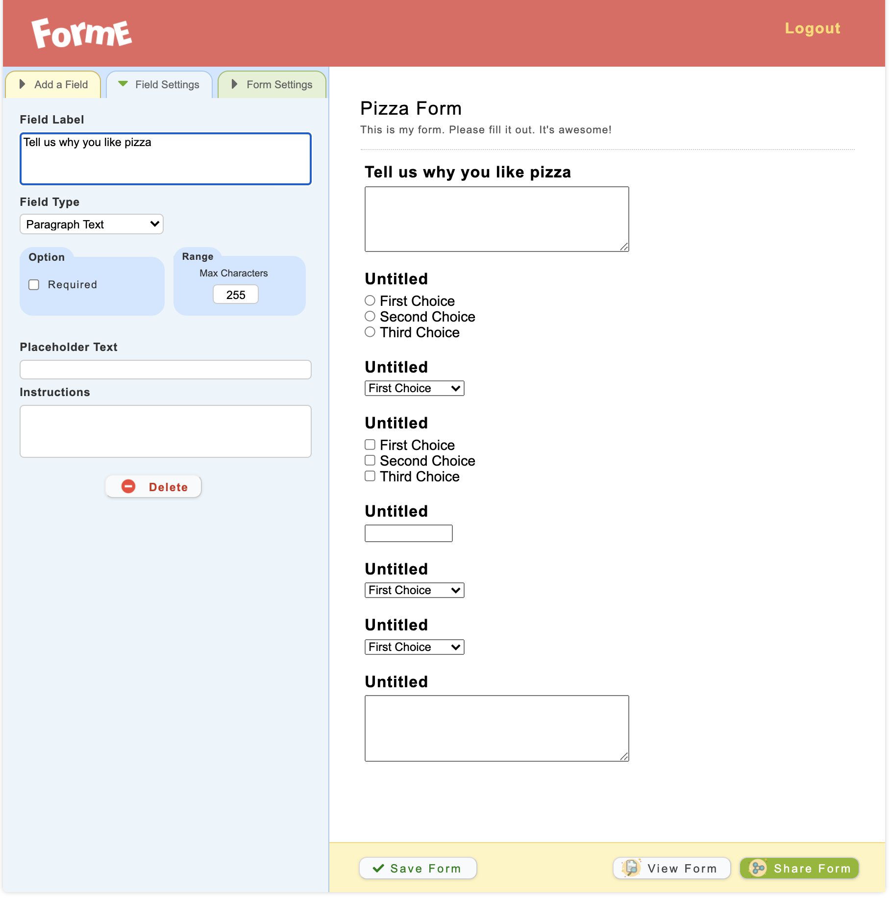

# ForMe

[Feature List](https://github.com/KagenLH/forme-app/wiki/Feature-List)

[Database Schema](https://github.com/KagenLH/forme-app/wiki/Database-Schema)

[Frontend Routes](https://github.com/KagenLH/forme-app/wiki/Frontend-Routes)

## About ForMe

[ForMe](https://forme-live.herokuapp.com/), a Wufoo clone, is a fullstack app to created to build customizable forms. Users can create new forms by adding field types, field settings, and form settings. The created forms are then rendered for the user to preview, share, or delete.

## Site in Action





## Application Architecture

ForMe's frontend is built on a React with Redux to manage the application's state. Python backend is used to serve the frontend using Flask. PostgreSQL is used as the application's database.

## Frontend Overview

ForMe uses React for the frontedn to provid a smooth and snappy experience for the user

### Frontend Technologies Used

#### React

React is a front-end Javascript library used to handle webpage renderings and UI. Everything displayed to the user is served with React.

#### Redux

Redux is used by the Foodlewd app to make API calls the the backend and handle state in the Redux store.

## Backend Overview

ForMe uses Python with a Flask framework to queery the PostgrSQL database.

### Backend Technologies Used

#### Flask

Flask is an extensible framework used as ForMe's backend. Flask created the routes to respong to API calls made by the frontend.

#### SQLAlchemy

SQLAlchemy is an Object Relational Mapper used with Flask to write queries to to and from the database. Mapping classes are used to create relationships and columns between multiple tables in the database.

#### Alembic

Alembic is used to migrate the created class tables to the database and keep track of all the migration versions.

## Conclusions and Next Steps

Users are able to create and save forms, so the next step would be to make a way for those forms to be shared and filled out. The resulting form information can then be used to compile data within a chart, graph, or any other metric for the form owner to use.

Forms right now are shared by a copy and paste link. Shared forms should be sent and managed by email, so non-users can still fill out the form without having to sign up.

## Installation Instructions

1. Clone this repository (only this branch)

    ```bash
    git clone https://github.com/appacademy-starters/python-project-starter.git
    ```

2. Install dependencies

    ```bash
    pipenv install --dev -r dev-requirements.txt && pipenv install -r requirements.txt
    ```

3. Create a **.env** file based on the example with proper settings for your
   development environment
4. Setup your PostgreSQL user, password and database and make sure it matches your **.env** file

5. Get into your pipenv, migrate your database, seed your database, and run your flask app

    ```bash
    pipenv shell
    ```

    ```bash
    flask db upgrade
    ```

    ```bash
    flask seed all
    ```

    ```bash
    flask run
    ```

6. To run the React App in development, checkout the [README](./react-app/README.md) inside the `react-app` directory.

---

_IMPORTANT!_
If you add any python dependencies to your pipfiles, you'll need to regenerate your requirements.txt before deployment.
You can do this by running:

```bash
pipenv lock -r > requirements.txt
```

_ALSO IMPORTANT!_
psycopg2-binary MUST remain a dev dependency because you can't install it on apline-linux.
There is a layer in the Dockerfile that will install psycopg2 (not binary) for us.

---

## Deploy to Heroku

1. Before you deploy, don't forget to run the following command in order to
   ensure that your production environment has all of your up-to-date
   dependencies. You only have to run this command when you have installed new
   Python packages since your last deployment, but if you aren't sure, it won't
   hurt to run it again.

    ```bash
    pipenv lock -r > requirements.txt
    ```

2. Create a new project on Heroku
3. Under Resources click "Find more add-ons" and add the add on called "Heroku Postgres"
4. Install the [Heroku CLI](https://devcenter.heroku.com/articles/heroku-command-line)
5. Run

    ```bash
    heroku login
    ```

6. Login to the heroku container registry

    ```bash
    heroku container:login
    ```

7. Update the `REACT_APP_BASE_URL` variable in the Dockerfile.
   This should be the full URL of your Heroku app: i.e. "https://flask-react-aa.herokuapp.com"
8. Push your docker container to heroku from the root directory of your project.
   (If you are using an M1 mac, follow [these steps below](#for-m1-mac-users) instead, then continue on to step 9.)
   This will build the Dockerfile and push the image to your heroku container registry.

    ```bash
    heroku container:push web -a {NAME_OF_HEROKU_APP}
    ```

9. Release your docker container to heroku

    ```bash
    heroku container:release web -a {NAME_OF_HEROKU_APP}
    ```

10. set up your database

    ```bash
    heroku run -a {NAME_OF_HEROKU_APP} flask db upgrade
    heroku run -a {NAME_OF_HEROKU_APP} flask seed all
    ```

11. Under Settings find "Config Vars" and add any additional/secret .env
    variables.

12. profit

### For M1 Mac users

(Replaces **Step 8**)

1. Build image with linux platform for heroku servers. Replace
   {NAME_OF_HEROKU_APP} with your own tag:

    ```bash=
    docker buildx build --platform linux/amd64 -t {NAME_OF_HEROKU_APP} .
    ```

2. Tag your app with the url for your apps registry. Make sure to use the name
   of your Heroku app in the url and tag name:

    ```bash=2
    docker tag {NAME_OF_HEROKU_APP} registry.heroku.com/{NAME_OF_HEROKU_APP}/web
    ```

3. Use docker to push the image to the Heroku container registry:

    ```bash=3
    docker push registry.heroku.com/{NAME_OF_HEROKU_APP}/web
    ```
